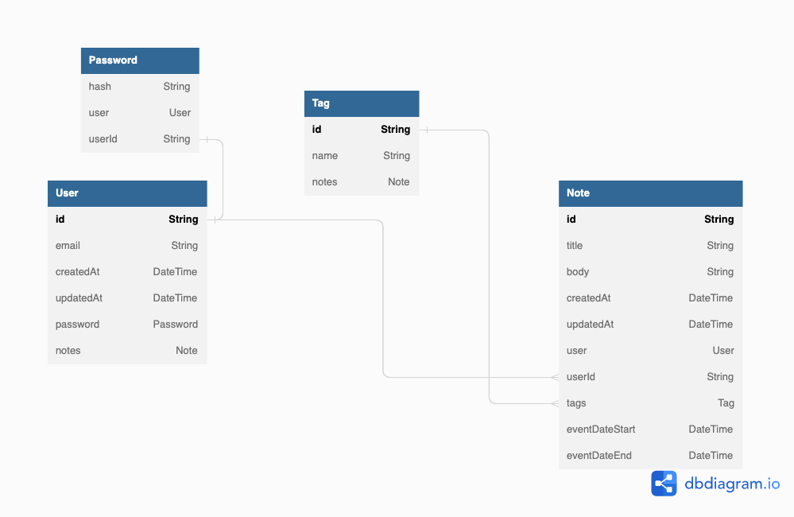

There is a special approach to life that is called polymathic. In short words, it means the holistic process of integrating multiple disciplines, or specializations, with the aim of creating something unique, towards oneness. I was fascinated by this concept, getting a holistic view of many branches of human knowledge to mix them to create something new.

Most of the knowledge about this topic is coming from the book ["Why Polymaths?: How Multi-Specialists Revolutionize the Way We Learn, Work, and Live"](https://www.amazon.com/gp/product/B0BTCGNDGM/ref=kinw_myk_ro_title) by [Aksinya Samoylova](https://www.amazon.com/Aksinya-Samoylova/e/B0BTFLH7RW/ref=dp_byline_cont_ebooks_1), which I highly recommend.

So here a new project of mine was born: Holistic History.

History is about how people related to each other, and created commerce (or wars). It's about how culture progressed, how we lost some aspects of the culture, or how we don't know (much) about other cultures.

We, as people, are defined not only by our education, character, etc., but also by our society, which is the result of our past, our history, and its contamination across different cultures. And sometimes we struggle to make our present and future better.
That's one of the purposes of coding: creating to make something better. Sometimes it's a client project and sometimes is our project.

it's also crafting something with our skills, and how we propagate our craft to the public or clients through communication and various aspects of society.

The project will be about a holistic view of historical events, and how they relate to each other. It's massive, but it will be my playground and hopefully, I can ship something within the year!

I'll be using some tech to experiment with, starting with Remix, with Prisma as ORM, and SQLlite as DB. I will share the progress here and on my Substack notes / Instagram / Twitter. Here's the first scratch of DB.

If you'd like to subscribe to my new polymathic newsletter, [here's the link!](https://polymathicwebdeveloperdigest.substack.com/)
